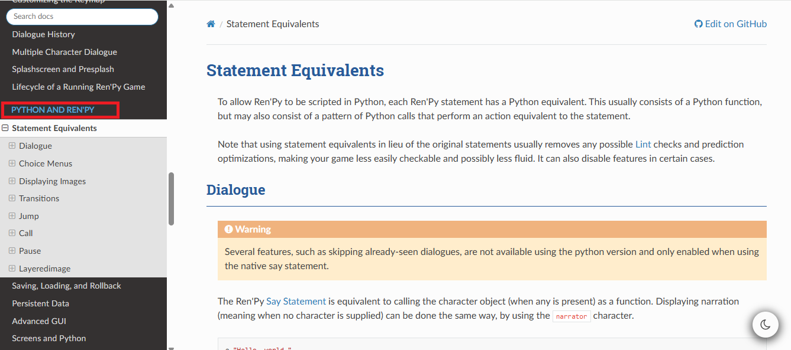
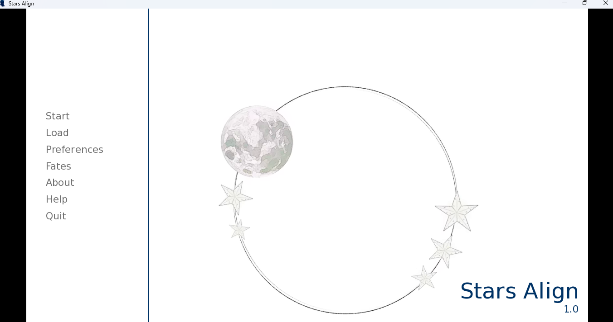
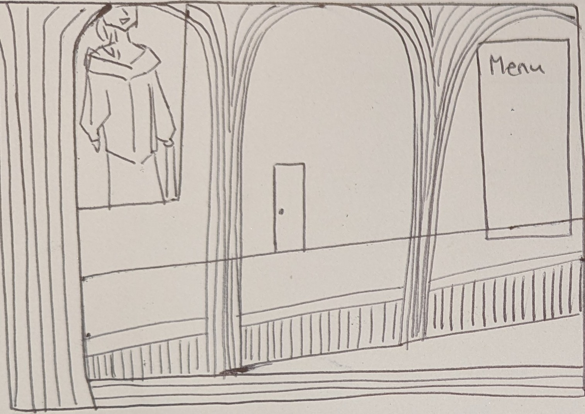
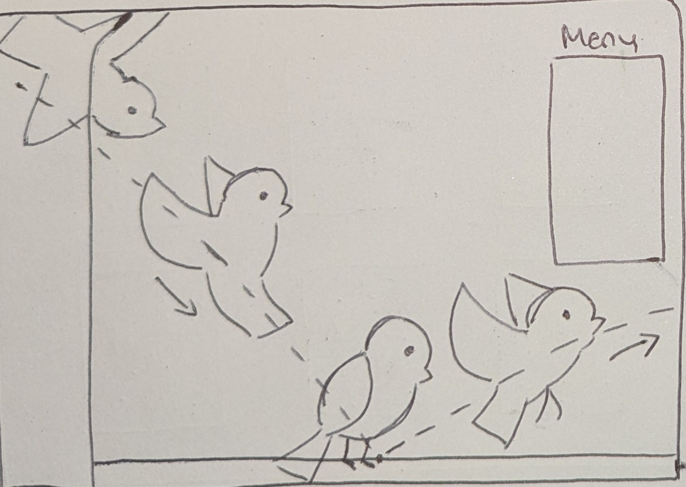
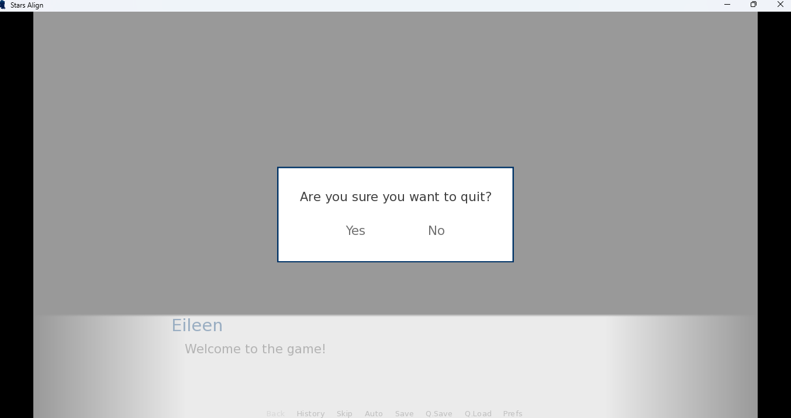
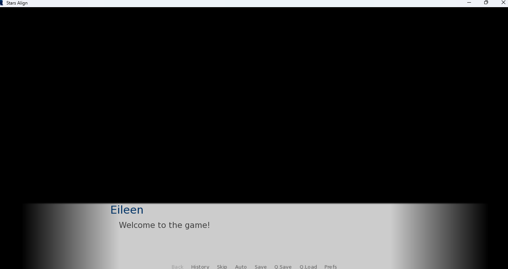
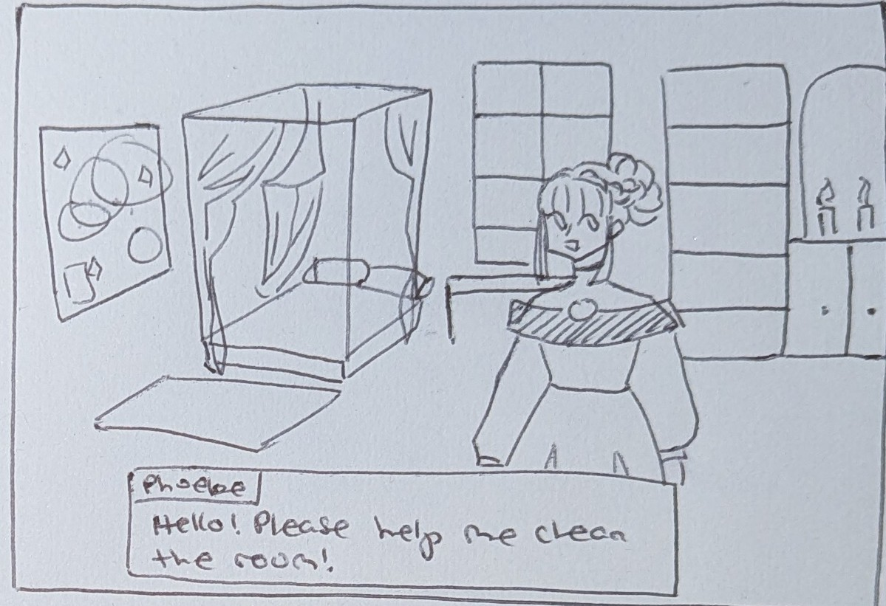
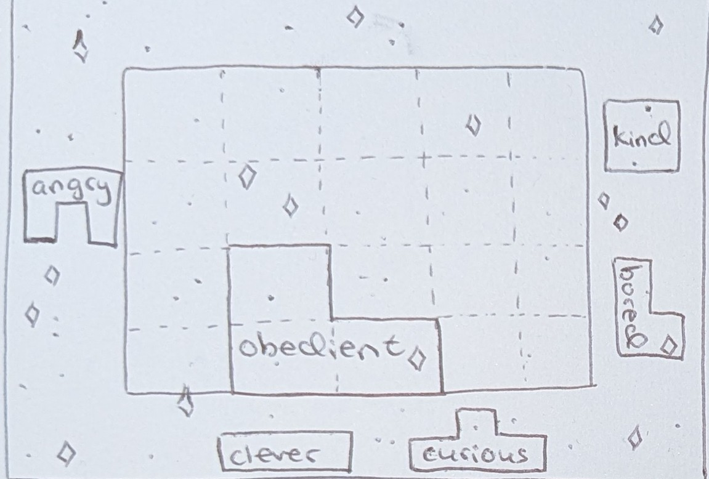
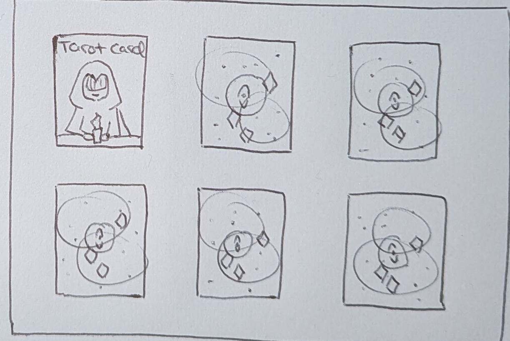
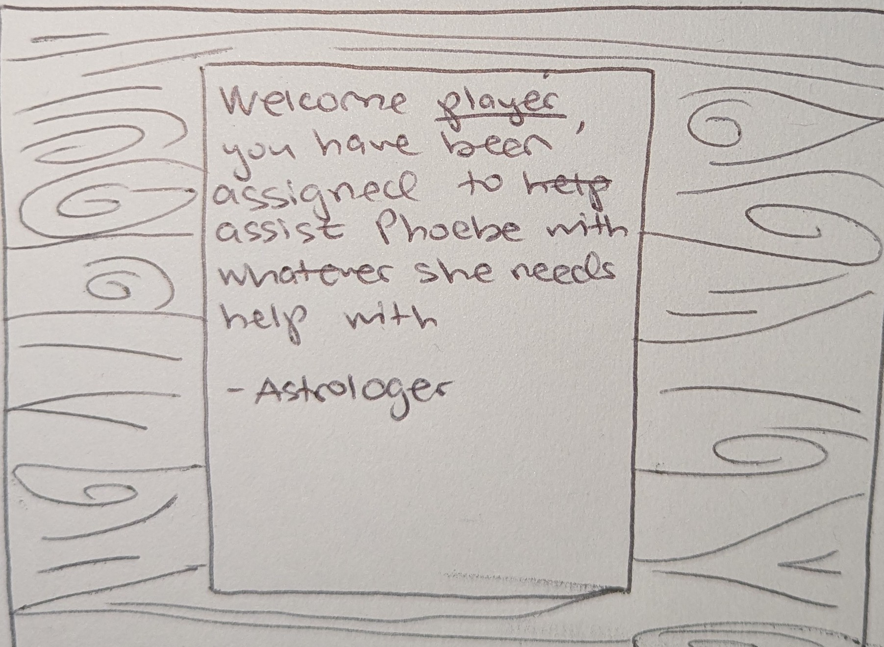

# **Introduction**

This conceptual overview summarizes the most important technical details about ‘Stars Align’, that a game developer would need to know in order to set up their workspace to create it and understand what the project is about. A programmer should read this if they are new to the project and want to gain a base understanding of how ‘Stars Align’ is meant to look and operate when it is complete and how it is being developed currently.

‘Stars Align’ is currently being developed by one person, Katie Rybakova, as a passion project. It is based on escape room games made by companies like Haiku games, and the existentialism of Galactic Cafe’s Stanley Parable. Modeled after the funny repetitiveness of movies like Ground Hog Day the game is meant to simulate the same day cycle, yet provide the player with a feeling of progression and new possibilities to explore, despite the small room they are stuck helping in.

# 

# **Development**

Due to this game being developed by one person the game is being developed part by part, divided up by puzzles. Each week a specific puzzle is researched and it is broken down into its core pieces. Example puzzles are also saved and analyzed. After about a week the design for the general mechanism by which a puzzle should work is completed and Katie spends about another week actually writing the code and testing it to make sure it works with the rest of the game created thus far.

# 

# **Parts and Tools**

## *Game Infrastructure*

This section goes over the basic tools and setup that the programmer will need to begin developing the game. 

* Language: Python   
* Game engine: Ren'Py[^1]  
* Programming editor: Visual Studio Code  
* Genre: 2D visual novel[^2], point and click, puzzle game

The programmer, after downloading Ren’Py would have access to Visual Studio Code as it downloads a basic version of the software along with the game engine. Inside this engine the programmer would be able to build their game by uploading 2D assets and writing code in Python, as well as making use of special Ren’Py specific functions. All relevant functions to this project thus far will be discussed in the tutorial sections of this documentation.

There is a very long list of all Ren’Py specific or Python equivalent functions, methods and statements which can be found [here](https://www.renpy.org/doc/html/statement_equivalents.html).  
In the image you will see Statement Equivalents which is the most important section, but if you require functions not listed under that category, or something more complex, then refer to the left side and search under the category ‘Python and Renpy’, it will explain in its database if Ren’Py is incapable of specific function within its game engine, if it has a Ren’Py equivalent, or if it can be written using traditional Python.

## 

## *Game UI*

This section goes over the basic set up of the game’s UI. This should be read to gain an understanding of the way the UI will operate and interact between the different screens in broad strokes, as well as how they should look.

Main menu **should have:**

* Start game  
* Load (a previous save file)  
* Preferences  
* Fates  
* Achievements  
* About  
* Help  
* Quit

Here is an example of what the current main menu looks like.

This is what it will look like once the art for it is complete.

Overlaid on top of the main menu screen will be a little animation of a white dove flying in, sitting on the architecture, and then flying off screen again.

If the player tries to leave the game, the following screen will appear.

In game menu **should have**:

* Save  
* Load   
* Preferences

In game menu **should not have**:

* Look back through dialogue history while they are playing  
* Skip dialogue  
* Go back in dialogue  
* Auto the dialogue (when dialogue plays on its own)

This is the current in-game menu.

This is what it will look like once all the art is completed:

Fates screen **should have**:

* The menu necessary to change a character’s character traits[^3]. 

As explained before, this game is based on astrology and constellations. So, the player is able to basically create and modify Phoebe’s non-specific zodiac sign to change her personality thanks to the Astrologer’s technology.  
Some character traits that are being considered for the character are:

* Obedient  
* Curious  
* Kind  
* Stubborn  
* Bored  
* Melancholic  
* Depressed  
* Clever  
* Frustrated

Based on the character traits present in Phoebe’s star sign, her behaviour, and the character’s access to puzzles, will subsequently change.  
This is what the ‘Fates’ screen will look like. It consists of a grid that will function as a puzzle, as the player has to figure out the optimal character trait blocks to place into it, and how to maximize the space provided. The actual grid would be 6x6.

Achievements screen **should have**:

* The menu necessary to change a character’s character traits

The Achievements screen will contain various tarot cards of characters or scenes that represent memories or recollections by Phoebe of her life before being restricted to the room you are helping to maintain.

All screens besides main menu should **not have** access to all the other screens, unless otherwise specified like with in game menu

* All sub screens (ie save, load, preferences, achievements, etc), should have a back button to return to the main menu

## *Gameplay Loop*

This section will explain the game’s internal gameplay and story structure. A programmer would need to understand this general loop before beginning development of specific puzzles or game mechanics.

- Introduction (or the tutorial): The player will be greeted by the Astrologer who will explain that they have been assigned to assist

- The player opens main menu  
  * Player can enter any of the permitted screens (as listed in game ui)  
  * The player enters the game and is greeted by the astrologer and is told that they should help the main character complete their day to day tasks while he does his work.  
- The player enters the basic game loop of cleaning the room  
  * The player at this point cannot actually do anything besides clean the room and after doing so completes the first game loop.  
  * The astrologer gives the player the ability to change the main character’s ‘characteristics’ allowing the player to now replay and gain access to certain puzzles and receive new dialogue options.  
  * The astrologer asks the main character to help the main character see the truth/help her get out.  
- A day’s game loop:   
  * Player changes main character’s ‘character traits’  
  * Player enters the game  
  * Player in the game can now access new information, puzzles and new tasks.  
  * Player completes tasks/puzzles  
  * The day loop ends when the player completes all the originally assigned tasks (clean the room)  
  * Ending!

There will be a variety of puzzles in this game once it is fully completed. Currently only two of the puzzles are properly finished, the rest being in progress. Here is the complete list of puzzles and how they should operate:

* **Grid**: the screen where the player can select what character traits to give Phoebe  
* Books: the screen where the player can swap books to place them in the correct order based on their titles.   
* **Candles**: the screen where the player can light candles in a specific order based on the clue on a   
* **Gears**: the screen where the player can put gears into their correct slots, which makes them all spin.  
* **Cleaning**: a screen on which the player has to click and collect miscellaneous items Phoebe has scattered across the room.  
* **Poetry**: a screen on which the player has to help Phoebe write a hymn and make it rhyme.  
* **The box**: a box on the sides of which are various puzzles that the player has to solve in order to open it and uncover the final clue to the mystery.

## *Endings:*

Vary depending on what ‘character traits’ the player gives the main character, although they are not truly endings but more like thoughts/monologues the main character shares based off the puzzles/information the player uncovers and how the player behaves

| Criteria | Ending |
| :---- | :---- |
| The player is consistently nice and validating of Phoebe’s ramblings. | Phoebe will not leave the room. She will insist that her version of events that led up to her being restricted to the room are reality and she will be incredibly friendly to the player. The player will be let go from their position of Phoebe’s assistant by the Astrologer. Phoebe will be upset when the player is forced to leave. The Astrologer is seemingly disappointed by the player’s inability to face the truth behind her actions. |
| The player is consistently rude and demeans Phoebe. | Phoebe will not leave the room. She will insist that her version of events that led up to her being restricted to the room are reality and she will lash out at the player for telling her otherwise.Phoebe will become more closed off and less talkative. The player will be let go from their position of Phoebe’s assistant by the Astrologer. Phoebe will be happy that the player leaves. The Astrologer is seemingly disappointed by the player’s inability to face the truth behind her actions. |
| The player is reasonable in their interaction with Phoebe. Kind yet establishes certain boundaries. | Phoebe will leave the room, after solving the most complicated puzzle (the box), finally willing to acknowledge and take responsibility for her previous actions. She leaves the room saying she will make things right with those she hurt and vice versa. It is shown she was speaking to a mirror. The player, however, will receive a thank you letter from the Astrologer instead of a notice of leave. The player instead gets to go on a vacation. It is not meant to be clear if the player spoke through the mirror or if it was a figment of Phoebe’s imagination. |

[^1]:  Ren’Py: Ren’Py Visual Novel Engine, or Ren’Py for short is a free and open-source game engine which was specifically designed for the creation of visual novel games.

[^2]:  Visual novel: a form of digital interactive fiction characterized by static or minimally moving sprites. The game focuses on story and player choices. (example: Ace Attorney)

[^3]:  Character traits/characteristics: within the game the player can define the main character’s personality by giving them specific stars in a constellation. For example, they could give them a star segment that states they are curious, giving the player the chance to explore. Alternatively, the player can define the character to be melancholic, making them more sad and introspective in their dialogues.
